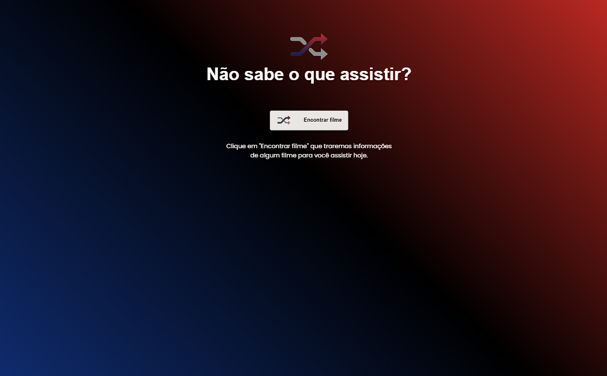

# Rocketflix

<h1 align="center">
  Rocketflix
</h1>

  <a href="#-tecnologias">Tecnologias</a>&nbsp;&nbsp;&nbsp;|&nbsp;&nbsp;&nbsp;
  <a href="#-projeto">Projeto</a>&nbsp;&nbsp;&nbsp;|&nbsp;&nbsp;&nbsp;
  <a href="#-deploy">Deploy</a>&nbsp;&nbsp;&nbsp;&nbsp;&nbsp;&nbsp;

 

  

## 🚀 Tecnologias

Esse projeto foi desenvolvido com as seguintes tecnologias:

- HTML5
- CSS3
- Javascript
- TheMovieDB API

## 💻 Projeto

Projeto desenvolvido como prática de consumo de uma API terceira (TheMovieDB) de acordo com o desafio proposto no programa Discover da Rocketseat.

## 🔖 Deploy

## [Rocketflix](https://mancinilucas.github.io/lm-rocketflix/)
